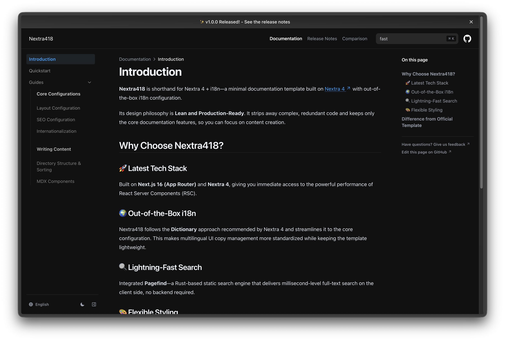

# Nextra418

中文 | [English](./README.md)

---

## ⚡️ 轻量且生产可用的 Nextra 4 + i18n 文档模板

**Nextra418** 是 Nextra 4 + i18n 的缩写，是一个基于 [Nextra 4](https://nextra.site/) 打造的极简文档模板，同时提供了开箱即用的多语言配置。

它的设计哲学是 **Lean and Production-Ready**（轻量且生产可用）。它填补了官方 `nextra-docs-template` 长期未维护的空白，剔除了复杂的冗余代码，只保留最核心的文档功能，让你能专注于内容创作。



### ✨ 核心特性

- **最新技术栈**：基于 **Next.js 16 (App Router)**、**Nextra 4** 和 **React 19** 构建，第一时间体验 React Server Components (RSC) 的强大性能。
- **开箱即用的 i18n**：遵循 Nextra 4 官方推荐的**字典 (Dictionary)** 方案，并精简为最核心配置，多语言 UI 管理更规范轻量。
- **极速搜索体验**：内置 [Pagefind](https://pagefind.app/) —— 基于 Rust 的静态搜索引擎，在客户端提供毫秒级全文检索，无需后端服务。
- **灵活无拘束的样式**：保持 **Unopinionated** 设计哲学，不强制捆绑特定的 CSS 框架，自由集成喜欢的样式方案。
- **极致的开发体验**：预配置 TypeScript、自定义 MDX 组件以及 Next.js App Router 最佳实践。

### 🧭 如何选择模版？

目前有多个优秀的 Nextra 模版可供选择。**Nextra418** 的设计初衷是为那些追求 **极简、核心功能、以及现代 App Router 架构** 的开发者提供一个干净的起点。

你可以参考下表，选择最适合你的方案：

| 模版                                                                                       | 侧重点          | 适用人群                                                    |
| :----------------------------------------------------------------------------------------- | :-------------- | :---------------------------------------------------------- |
| **Nextra418** (本项目)                                                                     | **极简 & 核心** | 需要一个干净、现代 (App Router) 且无冗余代码的起点。        |
| [官方模版](https://github.com/shuding/nextra-docs-template)                                | 官方/标准       | 更习惯传统的 **Pages Router** 文件夹结构的用户。            |
| [Docs Starter](https://github.com/phucbm/nextra-docs-starter)                              | 内容丰富        | 想要开箱即用的页面（关于、联系）和 **Tailwind v4** 的用户。 |
| [Landing Template](https://github.com/gfazioli/next-app-nextra-template)                   | 全能型          | 需要 **Landing Page + 文档** 且偏好 **Mantine UI** 的项目。 |
| [Personal Website](https://github.com/namnguyenthanhwork/nextra-personal-website-template) | 个人主页        | 想要用 **shadcn/ui** 搭建 **博客 + 文档** 的个人开发者。    |
| [SWR Site 示例](https://github.com/shuding/nextra/tree/main/examples/swr-site)             | 官方参考        | 想要深入研究官方代码库中复杂的 i18n 配置。                  |

如果你想要一个轻量、生产可用且能够完全掌控其架构的基础模版，**Nextra418** 是你的最佳选择。

### 🚀 快速开始

#### 一键部署

最快让你的文档站点上线的方式：

[](https://vercel.com/new/clone?repository-url=https%3A%2F%2Fgithub.com%2FnotURandomDev%2Fnextra418)

#### 本地开发

只需三步，在本地环境运行：

```bash
git clone git@github.com:notURandomDev/nextra418.git
cd nextra418
pnpm install
pnpm dev
```

现在，你的文档站点已经成功运行在 `http://localhost:3000`。

### 📚 查看文档

详细的文档位于 `content` 目录下。本地服务运行后，你可以直接访问网站查看指南，了解如何：

- 配置站点基础信息（`app/_config/meta.config.tsx`）
- 使用 `_meta.ts` 组织和编写文档
- 自定义主题与布局结构
